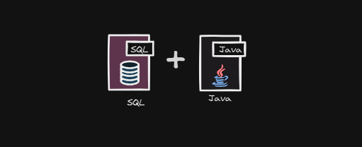

<h1><center>¿Cómo hacer una conexion con una base de datos en java?</center></h1>

<center><h3>Este repositorio esta el paso a paso a seguir para hacer una conexion db con el lenguaje java, igualmente la utilización de query con interacion a la base de datos<h3></center>

<center></center>

<h2>Paso 1</h2>
Crear un proyecto Maven o Gradle. 

Elegir gestor de base de datos de preferencia (sqlite, mysql, maria db, postgresql etc).

<h2>Paso 2</h2>
Buscar el driver correspondiente dependiendo su gestor de base de datos. Para estos caso siempre se trabaja con JDBC conector pero para cada gestor utiliza diferentes driver pero con el mismo objetivo. Ejemplo de myql es mysql connector.

<h2>Paso 3</h2>
Instalar la dependiencia en el gestor para maven utiliza el <i>pom.xml</i> para <i>gradle build.gradle</i>

Ejemplo entra en pom.xml y agregar esto, en automatico se intala la dependencia:

````xml
<dependencies>

<dependency>
    <groupId>mysql</groupId>
    <artifactId>mysql-connector-java</artifactId>
    <version>8.0.33</version>
</dependency>

</dependencies>

`````
<h2>Paso 4</h2>
Hacer una conexion dentro del lenguaje por buenas practicas de lenguaje se utiliza el patron de diseño singleton en que consiste obtener una sola instacia para todo el programa ideal para estos caso. <a href="https://refactoring.guru/es/design-patterns/singleton" >Leer más sobre el patron de diseño.</a>

Entonces empezaremos con crear una clase llamada conexion, en el que encapsularemos estos datos.

````java
public class Conexion{
    private Connection conexion=null; 
	//CAMBIAR EL NOMBRE DE LA BASE DE DATOS
    private final url="jdbc:mysql://localhost:3306/database";
    private final string username="root";
	//CONTRASEÑA DE LA CONEXION
    private final string password="admin";

    public static Conexion getInstancia; //Instancia global
}
````

Crear un contructor donde se conecte el driver del gestor con la base de datos:

````java
private Conexion(){
    try{
        //En el caso se este utilizando sqlite no se pondra password y username, solo url
        conexion = DriverManager.getConnection(url,password,username);
		System.out.println("Conexion exitosa");
    }catch(SQLExeption error){
        System.err.println("Error: "+error.getMenssage());
    }
}
````

Finalmente creamos las demas funciones:
`````java
// Esta fucion es importante ya con con esta obtendremos la instancia creada
public static Conexion getInstancia() {
		if (instancia == null) {
			instancia = new Conexion();
		}
		return instancia;
	}

	// Con esta funcion obtendremos la conexión
	public Connection getConexion() {
		try {
			if (conexion == null || conexion.isClosed()) {
				//Se crea una conexion en caso que este cerrada
				conexion = DriverManager.getConnection(url, password, username);
			}
		} catch (SQLException e) {
			System.err.println("Error al obtener la conexión: " + e.getMessage());
		}

		//Retorna la conexión si no esta cerrado
		return conexion;
	}
	// Procedimiento para cerrar conexión
	public void cerrarConexion() {
		try {

			if (conexion != null && !conexion.isClosed()) {
				//Cierra la conexíon
				conexion.close();
			}

		} catch (SQLException error) {
			System.err.println(error.getMessage());
		}
	}
``````

<h2>Paso 5</h2>
<center><h3>¿Cómo saber si realmente funciona?</h3></center>

Debemos hacer una conexión utilizando la clase creada posteriormente:

`````java
import java.sql.*;

public static void main(String [] args){
	// Obtenemos la instancia y la conexion
	Connection conexion = Conexion.getInstancia().getConexion();
	// Y finalmente se cierra conexión
	Conexion.getInstancia().cerrarConexion();
}
``````

En su terminal debe salir el mensaje de <i>"conexion exitosa"</i>

<center><h2>¿Cómo interatuar con la base de datos</h2>

Antes de interatuar con base de datos hay que conocer las funciones que existen que nos permitera hacer dichas acción:

<table>
  <tr>
    <th>Tipo</th>
    <th>Uso principal</th>
    <th>En qué se utiliza</th>
  </tr>
  <tr>
    <td>Statement</td>
    <td>SQL estático (DDL, consultas sin parámetros)</td>
    <td>Crear/alterar/dropear tablas, ejecutar scripts DDL</td>
  </tr>
  <tr>
    <td>PreparedStatement</td>
    <td>Sentencias parametrizadas</td>
    <td>INSERT, UPDATE, DELETE y SELECT con parámetros de usuario</td>
  </tr>
  <tr>
    <td>CallableStatement</td>
    <td>Llamar procedimientos almacenados</td>
    <td>Ejecutar `stored procedures` con parámetros IN/OUT</td>
  </tr>
  <tr>
    <td>ResultSet</td>
    <td>Recorrer resultados de consultas</td>
    <td>Iterar fila a fila datos devueltos por un SELECT</td>
  </tr>
</table>
</center>

Ejemplo para crear una tabla:

````java
String query="""
			CREATE TABLE usuarios(
				id BIGINT PRIMARY KEY AUTO_INCREMENT,
				nombre VARCHAR(250),
				apellidos VARCHAR(250),
				telefono VARCHAR(250)
			);
			""";
// Ten encuenta que debe estar la conexion abierta
try(Statement sentencia = conexion.createStatement()){
	setencia.executeUpdate(query); 
}catch(SQLExeption error){
	System.err.println(error.getMenssage());
}
````

Ejemplo para insertar datos:
````java
			// Por que se usa "?", es para indicar el valor 
			// que se le asiganara a cada atributo
String query="""
			INSERT INTO usuarios (nombre, apellidos, telefono)
			VALUE (?, ?, ?); 
			""";

try(PreparedStatement sentencia = conexion.preparedStatement(query)){
	// Aqui lo que hacemos el darle valor a los ?
	sentencia.setString("Pepito");
	sentencia.setString("gomez gomez");
	sentencia.setString("55-77-99-30");

	int filasAfectadas=sentencia.executeUpdate();

	if(filaAfectadas > 0){
		System.out.println("Se inserto el dato");
	}
}catch(SQLExeption error){
	System.err.println(error.getMenssage());
}
````

Ejemplo para obtener todos los datos con un SELECT * FROM:

````java
String query = "SELECT * FROM usuarios;";

try(Statement consulta=conexion.createStatement()){
	try(ResultSet resultado=consulta.executeQuery(query)){

		while(resultado.next()){
			// Aquí lo para obtener cada datos se usa el get
			// y el tipo de dato, y como parametro el nombre del  atributo
			System.out.println(resultado.getString("nombre"));
			System.out.println(resultado.getString("apellidos"));
			System.out.println(resultado.getString("telefono"));
		}
	}
}catch(SQLExeption error){
	Sytem.out.println(error.getMenssage());
}

````

Siguéme en mi github <a href="https://github.com/AlfreGood20">Click aquí.</a>